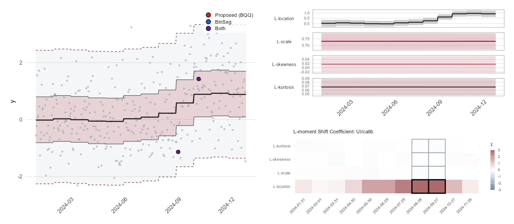
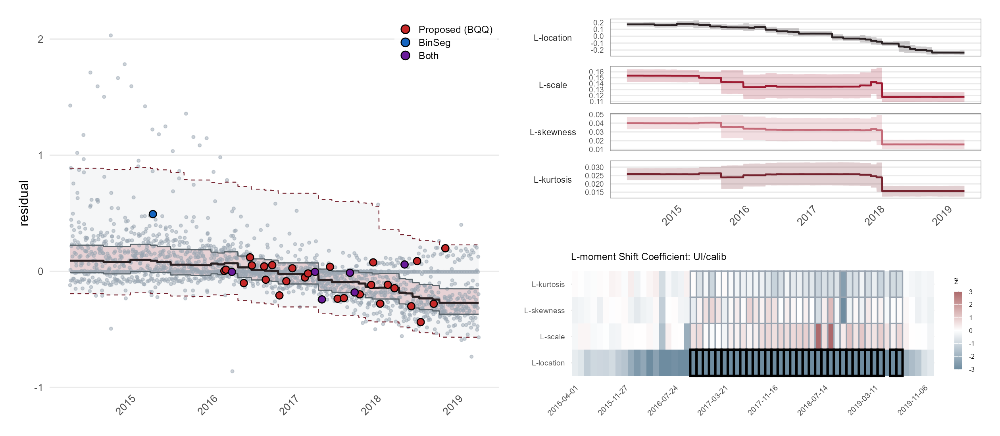

# bqq: Bayesian Quintuple Quantile Chart

**bqq** implements a Bayesian quintuple quantile (BQQ) charting approach for Phase I
statistical process monitoring. It fits a multi-quantile regression model jointly
across quantile levels — a smoothed score likelihood with non-crossing and
interquantile-shrinkage penalties and sparsity-inducing priors on blockwise shift
coefficients, computed via [Stan](https://mc-stan.org/) — and detects distributional
change-points through calibrated block tests on the shift coefficients.

## Installation

Install the development version from GitHub:

```r
# install.packages("devtools")
devtools::install_github("yuhuiyao88/bqq")
```

### Requirements

- R >= 3.5.0
- [rstan](https://mc-stan.org/rstan/) >= 2.21.0 (and a working C++ toolchain for Stan)
- Recommended: [quantreg](https://cran.r-project.org/package=quantreg) (pilot LASSO
  quantile-regression initialization and adaptive IQ weights; the package falls back
  gracefully without it), ggplot2 and patchwork (plots)

## Overview

The BQQ methodology fits the five conditional quantiles (0.025, 0.25, 0.5, 0.75,
0.975) jointly over time, anchors their in-control levels with a prior elicited from
a warm-up period, and represents distributional changes through blockwise shift
coefficients, so change-point detection becomes structured variable selection.
The package provides:

- **Model fitting** via MAP estimation (with Laplace posterior draws), MCMC, or
  MAP-initialized MCMC, from a built-in Stan program
- **An informative warm-up prior for the intercepts** (the default): each
  per-quantile intercept is centered at the warm-up-window empirical quantile with
  unit-information scale — equivalently, a power prior on the warm-up period with
  discount `a0 = 1/w`
- **Sparsity-inducing priors** on the shift coefficients (spike-and-slab primary;
  LASSO, adaptive LASSO, group LASSO, heterogeneous group LASSO, and
  spike-and-slab LASSO alternatives)
- **Interquantile (IQ) shrinkage** that fuses adjacent-quantile coefficients with
  data-adaptive weights, its weight `lambda_iq` **tuned by cross-validation on a grid**
  together with the prior hyperparameter, and a **non-crossing penalty** preserving
  quantile ordering
- **Change-point detection** by posterior whitening of the shift coefficients
  followed by union–intersection (UI) and Hotelling T² block tests, run on the raw
  quantile basis and/or the QSS shape basis, with the full across-block adjustment
  family (raw, Holm, Bonferroni, BH, and calibrated single-step charting constants
  controlling the family-wise false-alarm probability)
- **Quantile Shape Statistics (QSS)**: location, scale, skewness, and kurtosis
  profiles derived from the fitted quantile process
- **Cross-validation** for hyperparameter tuning and **visualization** for quantile
  processes, QSS profiles, and shift heatmaps

## Quick Start

The proposed method end to end: a grid search by cross-validation over the prior
hyperparameter and the interquantile fusion weight `lambda_iq`, the final MAP fit at the
winning pair, change-point detection on the three bases, and the figures. No EM is
run anywhere: every CV fit and the final fit is a single MAP fit with `adaptive_iq = FALSE`.
The block takes about «QS_MIN» minutes on a laptop (20 grid points, two folds, then the
final fit with 20,000 Laplace draws); it flags «QS_FLAGS» and localizes the change to
«QS_DATE».

```r
library(bqq)
set.seed(123)

# ---- 1. Data: a daily series with a sustained mean shift from day 252 on ----
n     <- 360
dates <- as.Date("2024-01-01") + 0:(n - 1)
y     <- rnorm(n)
y[252:n] <- y[252:n] + 1

# ---- 2. Quantile levels, warm-up period, block design ----
taus <- c(0.025, 0.25, 0.5, 0.75, 0.975)
w <- 30                                  # warm-up period: the in-control reference window
l <- 30                                  # block length
H <- getSustainedShift(n, l = l, w = w)  # r = (n - w) / l = 11 sustained-shift blocks

# ---- 3. Grid search by cross-validation: prior hyperparameter x lambda_iq ----
# Order-preserved 2-fold CV over a grid whose columns are getModel() arguments.
# lambda_iq2 = lambda_iq^2 IS a grid column: lambda_iq in {0, 1, 10, 100, 1000}
# (0 = no fusion), crossed with spike_sd. adaptive_iq = FALSE: no EM in any fit.
# Rows come back sorted by the validation criterion (loss = "score").
grid <- expand.grid(lambda_nc = 50, spike_sd = c(0.1, 0.15, 0.25, 0.4),
                    lambda_iq2 = c(0, 1, 10, 100, 1000)^2)
cv <- cv_copss_grid(y, taus, H = H, w = w, grid = grid,
                    base_args = list(prior_gamma = "spike_slab", adaptive_iq = FALSE),
                    loss = "score", seed = 1)
cv$lambda_iq <- sqrt(cv$lambda_iq2)
cv[, c("lambda_nc", "spike_sd", "lambda_iq", "val_score", "val_pinball")]
best <- cv[1, ]                          # the winner

# ---- 4. Final fit at the winning pair: one MAP fit + Laplace draws, no EM ----
fit <- getModel(y, taus, H = H, w = w,
                prior_gamma = "spike_slab", spike_sd = best$spike_sd,
                lambda_nc = best$lambda_nc,
                lambda_iq2 = best$lambda_iq2, adaptive_iq = FALSE,
                fit_method = "map", map_hessian = TRUE,
                laplace_n_samples = 20000, seed = 1)
fit$map$termination          # optimizer exit status
sqrt(best$lambda_iq2)        # the interquantile fusion weight the CV selected

# ---- 5. Posterior predictive quantiles and change-point detection ----
eta <- getEta(fit, H = H, seed = 1)      # [draws x quantiles x time]
det <- detectChangepoints_gamma(fit, taus, l = l, w = w, y = y, eta = eta,
                                basis = c("quantile", "qss", "lmom"),
                                statistic = "ui", adjust = "raw",
                                signal_position = "score", alpha = 0.05,
                                laplace_n_samples = 20000, seed = 1)
det$tests$lmom$ui$raw                  # flagged blocks, L-moment basis, UI raw
det$detected_blocks                      # per block: onset, localized change-point, flags
dates[det$detected_blocks$signal_obs[det$tests$lmom$ui$raw]]   # localized dates

# ---- 6. Figures (the JSM 2026 style; ggplot2 and patchwork) ----
library(ggplot2)
ax <- list(date_breaks = "3 months", date_labels = "%Y-%m")   # yearly breaks by default
p1 <- plotQuantileProcess(fit, time = dates, detection = det, ylab = "y",
                          date_breaks = ax$date_breaks, date_labels = ax$date_labels)
p2 <- plotLmomProcess(fit, eta = eta, H = H, time = dates, detection = det,
                      date_breaks = ax$date_breaks, date_labels = ax$date_labels)
p3 <- plotQSSProcess(fit, eta = eta, H = H, time = dates, detection = det,
                     date_breaks = ax$date_breaks, date_labels = ax$date_labels)
p4 <- plotGammaHeatmap(fit, detection = det,
                       block_labels = format(dates[det$detected_blocks$obs_start]))
# The talk's three-panel figure. A comparator's change points color the circles:
# proposed, comparator, or both when within one block length of each other.
cp <- changepoint::cpts(changepoint::cpt.meanvar(y, method = "BinSeg", Q = 12,
                                                 penalty = "Asymptotic", pen.value = 0.05))
p5 <- plotBQQSummary(fit, det, time = dates, basis = "lmom", eta = eta, H = H,
                     comparator = cp, comparator_label = "BinSeg", ylab = "y",
                     date_breaks = ax$date_breaks, date_labels = ax$date_labels)
# ggsave("bqq_summary.png", p5, width = 12.6, height = 5.5, dpi = 200)
```



Notes on the steps:

- **Step 3, tuning grid.** Spike-and-slab priors (`"spike_slab"`, `"spike_slab_lasso"`)
  tune `spike_sd`; the LASSO-type priors (`"lasso"`, `"adaptive_lasso"`, `"group_lasso"`,
  `"het_group_lasso"`) tune `lambda_lasso2_b`, e.g.
  `expand.grid(lambda_nc = 50, lambda_lasso2_b = c(0.01, 0.05, 0.1, 0.5, 1))` with
  `base_args = list(prior_gamma = "lasso")`, and the final fit takes
  `lambda_lasso2_b = best$lambda_lasso2_b`. In both cases `lambda_iq2` stays on the grid
  as `c(0, 1, 10, 100, 1000)^2`, so a LASSO-type prior searches 5 x 5 = 25 points and a
  spike prior 4 x 5 = 20. Every CV fit is one MAP fit at its row's values
  (`adaptive_iq = FALSE`), the same estimator as the final fit, so the tuned pair belongs
  to the model that is fitted. Held-out scores within about one unit of each other are
  within fold noise.
- **Step 4, the fit.** The final fit repeats the winning row once with the full draw
  count. Pass `adaptive_iq = FALSE` explicitly: the package default is still the EM
  (`adaptive_iq = TRUE`), which is not used in this workflow because its fixed point on a
  change-point design is total fusion (`lambda_iq` in the tens of thousands), and at that
  value scale and shape shifts are no longer detectable. The EM remains available for
  comparison only.
- **Step 5, detection.** `adjust` is the across-block decision rule of record:
  `"raw"` (the default, used throughout) tests each block at level `alpha`; the
  alternatives are `"calib"`, `"holm"`, `"bonf"` and `"bh"`.
  Every plot renders exactly the rule, statistic and bases recorded in `det`.
- **Step 6, figures.** Onset rules are off; localized change-points are circles; the
  profiles are bands only; a `Date` axis gets yearly breaks unless `date_breaks` is
  set. `plotBQQSummary()` needs patchwork; the comparator needs the changepoint
  package (optional).

## Illustration: ARCOS oxycodone shipments in Alabama

The package ships the series of the manuscript's illustration as `arcos_al`: daily
oxycodone shipments to Alabama pharmacies, 2015-2019, in morphine milligram
equivalents per state resident, built from the DEA ARCOS records released by The
Washington Post (see `?arcos_al`). The analysis fits the residuals of a calendar
adjustment (holiday and day of the week) with a 90-day warm-up period and 30-day
blocks, here under the adaptive LASSO prior. The grid search tunes the local-rate
hyperparameter `lambda_lasso2_b` and `lambda_iq` together by the same 2-fold score
cross-validation as the Quick Start, 25 grid points, no EM.

```r
library(bqq); library(ggplot2)
data(arcos_al)
y     <- as.numeric(residuals(lm(mme_per_capita ~ holiday + factor(weekday), data = arcos_al)))
dates <- arcos_al$date
taus  <- c(0.025, 0.25, 0.5, 0.75, 0.975)
w <- 90; l <- 30
H <- getSustainedShift(length(y), l = l, w = w)          # r = 58 blocks

grid <- expand.grid(lambda_nc = 50, lambda_lasso2_b = c(0.01, 0.05, 0.1, 0.5, 1),
                    lambda_iq2 = c(0, 1, 10, 100, 1000)^2)
cv <- cv_copss_grid(y, taus, H = H, w = w, grid = grid,
                    base_args = list(prior_gamma = "adaptive_lasso", adaptive_iq = FALSE),
                    loss = "score", seed = 1)
best <- cv[1, ]                                          # «ARCOS_WINNER»
fit <- getModel(y, taus, H = H, w = w, prior_gamma = "adaptive_lasso",
                lambda_lasso2_b = best$lambda_lasso2_b, lambda_nc = best$lambda_nc,
                lambda_iq2 = best$lambda_iq2, adaptive_iq = FALSE,
                fit_method = "map", map_hessian = TRUE, laplace_n_samples = 50000, seed = 1)

det <- detectChangepoints_gamma(fit, taus, l = l, w = w, y = y,
                                basis = c("quantile", "qss", "lmom"), statistic = "ui",
                                adjust = "raw", signal_position = "score",
                                laplace_n_samples = 50000, seed = 1)
det$tests$lmom$ui$raw                                  # flagged blocks, L-moment basis
dates[det$detected_blocks$signal_obs[det$tests$lmom$ui$raw]]

# Binary segmentation (changepoint package) as the comparator of the talk
cp <- changepoint::cpts(changepoint::cpt.meanvar(y, method = "BinSeg", Q = 60,
                                                 penalty = "Asymptotic", pen.value = 0.05))
eta <- getEta(fit, H = H, seed = 1)
plotBQQSummary(fit, det, time = dates, basis = "lmom", eta = eta, H = H,
               comparator = cp, comparator_label = "BinSeg", ylab = "residual")
```



The grid search takes about «ARCOS_CV_MIN» minutes on a laptop (50 single fits on 58 blocks)
and the final fit with 50,000 Laplace draws about «ARCOS_FIT_MIN» minutes; it flags
«ARCOS_FLAGS» on the L-moment basis. `plotBQQSummary()` on the full draw set is slow,
so thin `fit$laplace_samples` to a few thousand draws before plotting.

## Core Functions

### Design Matrices

| Function | Description |
|---|---|
| `getSustainedShift(n, l, w)` | Cumulative step design: each column is 1 from its block start to the end (coefficients are shift *increments*) |
| `getIsolatedShift(n, l, w)` | Block-diagonal design for transient/windowed shifts |

### Model Fitting

| Function | Description |
|---|---|
| `getModel()` | Fit the joint multi-quantile model via MAP, MCMC, or MAP+MCMC; returns the fit, Laplace samples, `stan_data` (the exact prior/bandwidth used), and MAP diagnostics (`termination`, `coverage`) |
| `getLaplaceSamples()` | Approximate posterior samples from a MAP fit |
| `getEta()` | Predictive quantile array `[iterations x quantiles x time]` |

### Inference

| Function | Description |
|---|---|
| `getQSS()` | Quantile Shape Statistics (location, scale, skewness, kurtosis) from predictive quantiles |
| `detectChangepoints_gamma()` | Posterior whitening + UI / Hotelling T² block tests on the quantile and/or QSS bases; computes the full adjustment family (raw / Holm / Bonferroni / BH / calibrated) with the matching cell-level constants and flags, and records the decision rule (`adjust`) that all plots render |

### Cross-Validation

| Function | Description |
|---|---|
| `cv_copss_grid()` | Grid-search CV over hyperparameters (MAP fits); extra `getModel` arguments pass through `base_args` |

### Visualization

| Function | Description |
|---|---|
| `plotQuantileProcess()` | The data with the five fitted quantile curves over time; localized change-points as circles, colored by source when a comparator method's change-points are passed (`comparator`); block-onset rules off by default |
| `plotQSSProcess()` / `plotLmomProcess()` | QSS or L-moment profiles over time with credible bands (bands only by default) |
| `plotGammaHeatmap()` | Shift heatmap: whitened-z fill, grey borders on OOC blocks, black borders on localized cells — all decisions (basis, statistic, `adjust`, constants) taken from the `detection` object; `basis` selects the panels, `label_every` thins the block labels |
| `plotBQQSummary()` | The three-panel figure of the JSM 2026 talk: quantile process on the left, one basis's profile above its heatmap on the right (needs patchwork) |

A `Date` vector passed as `time` gets yearly axis breaks with rotated labels.

## Model Details

The conditional quantile at level τ_q and time i is modeled as

$$\eta_{q,i} = \beta_{0,q} + x_i^\top \beta_{X,q} + h_i^\top \gamma_q + \mathrm{offset}_i ,$$

estimated through a score-based likelihood with logistic smoothing of the check-loss
indicator (bandwidth by the Fernandes–Guerre–Horta rule of thumb) and a quantile
kernel `min(τ,τ′) − ττ′` coupling the levels.

### Priors (defaults)

- **Intercepts** `β0[q] ~ Normal(beta0_loc[q], beta0_scale[q])` with, by default,
  `beta0_loc` = the empirical τ-quantiles of the warm-up period and `beta0_scale` =
  the **unit-information** scale `sqrt(τ(1−τ)) / f̂` (Kass & Wasserman, 1995), where
  `f̂` is a kernel density estimate of the warm-up period. Together this equals the
  power prior on the warm-up period with discount `a0 = 1/w` (Ibrahim & Chen, 2000;
  Bourazas, Kiagias & Tsiamyrtzis, 2022), and anchors each intercept in the spirit
  of the empirical-quantile anchoring of Yang & He (2012). Both are overridable
  (`beta0_loc`, `beta0_scale`); with `log_flag = 1` everything is computed on the
  log (modeling) scale.
- **Shift coefficients** γ: spike-and-slab by default; five LASSO-type alternatives.
- **IQ shrinkage** fuses `|γ_q − γ_{q−1}|` with adaptive weights from pilot quantile
  regressions (Jiang, Wang & Bondell, 2013); the intercept is never IQ-penalized.
- **Non-crossing penalty**: L1 hinge on finite differences in τ.

### Computation

- `fit_method = "map"` (recommended): L-BFGS with **tight convergence tolerances**
  (`tol_rel_obj = tol_rel_grad = 1e2`, `iter = 10000`, `history_size = 25`). The
  smoothed-score objective has near-flat plateaus; loose tolerances can stop there
  prematurely while reporting convergence.
- **Initialization** (`map_init`): `"pilot"` (default) starts at marginal LASSO
  quantile-regression estimates per level (`quantreg::rq.fit.lasso` on `[1|X|H]`,
  intercept unpenalized, penalty scaling `sqrt(τ(1−τ) n log d)` following Belloni &
  Chernozhukov, 2011) — the LASSO-initialization strategy with oracle support in
  Fan, Xue & Zou (2014). `"prior_center"` starts at the prior mode (in-control
  state); `"random"` restores rstan's default.
- **Diagnostics**: every MAP fit reports `fit$map$termination` (translated
  optimizer exit status; exit code 70 = line search exhausted, the expected ending
  at a converged optimum) and `fit$map$coverage` (empirical coverage of the fitted
  curves), warning automatically when a fit looks wrong.

### Detection

Shift coefficients are posterior-whitened (`z̃ = Σ^{−1/2} γ̄`), then combined per
block by the UI statistic (max |z̃|) and/or Hotelling T² (sum z̃²). Each test returns
the full across-block family — raw, Holm, Bonferroni, BH, and the **calibrated**
single-step rule using analytic charting constants (Šidák-type) that control the
probability of any false alarm across all blocks and cells jointly.

### 0.6.10

- **Plots follow the JSM 2026 ARCOS figures** (`Box/2026Summer/JSM/talk_figures_lmom.R`).
  `plotQuantileProcess()` no longer draws block-onset rules by default (`show_onset = FALSE`)
  and gains a comparator overlay: pass another method's change-point indices as
  `comparator` and the localized change-points are drawn as circles colored by source
  (proposed, comparator, both within `match_tol` observations, default the block length)
  with an inset legend. `plotQSSProcess()` and `plotLmomProcess()` default to bands only
  (`show_onset = show_located = FALSE`). A `Date` `time` vector gets yearly breaks
  (`date_breaks`, `date_labels`). `plotGammaHeatmap()` gains `basis` (draw a subset of
  the recorded families), `label_every` (thin the block labels; automatic beyond 12
  blocks) and `note_clipping`. New `plotBQQSummary()` composes the talk's three-panel
  figure. No change to fitting or detection.
- **`arcos_al` dataset.** The daily ARCOS series of the manuscript's illustration ships
  with the package (`data(arcos_al)`, `?arcos_al`); the README shows the l = 30 adaptive
  LASSO analysis on it.

### 0.6.9

- **No unidentified parameters.** The global rates `lambda_lasso2` / `lambda_beta2` and the
  mixing weights `pi_slab` / `pi_slab_beta` used to be declared for every prior; under a prior
  that does not use them they had no prior and no effect, leaving a flat direction in the
  Hessian (handled by a pseudo-inverse). They are now length-0/1 vectors sized by the prior
  codes, like the hierarchy latents, and are named `lambda_lasso2[1]`, `pi_slab[1]`, ... in the
  MAP output. `.bqq_lp17()` and the warm start follow. Fits are unchanged for the priors that
  use them.

### 0.6.8

- **LASSO-type priors are fitted with their scale latents integrated out.** The joint
  MAP of the normal scale-mixture hierarchies (`lasso`, `group_lasso`, `het_group_lasso`,
  `adaptive_lasso`, and the same priors on `betaX`) does not exist: the joint density is
  unbounded as a scale latent tends to 0 together with its coefficients, and the optimizer
  occasionally reached that spike (a het_group_lasso fit on a 90-point series failed with
  "Initialization failed" on every retry). The Stan program now uses the marginal priors:
  `lasso` is Laplace with rate `sqrt(lambda_lasso2)` (Park and Casella, 2008); `group_lasso`
  is `lambda^m exp(-lambda ||gamma_j||_2)` with its normalizing constant (Kyung et al., 2010,
  hierarchy (6)); `adaptive_lasso` is Laplace with local rate `sqrt(lambda2_qj)` and keeps
  `lambda2_qj ~ Gamma(a, b)`; `het_group_lasso` is Laplace with block rate `sqrt(omega_j)` and
  keeps `omega_j ~ InvGamma(1/2, c/2)`. `.bqq_lp17()` matches term by term. The group norm is
  smoothed in the optimizer with the IQ constant (`sqrt(||g||^2 + iq_smooth^2)`). Results
  change for these four priors relative to 0.6.7; spike-and-slab priors are unaffected.

### Documented workflow since 2026-09-09: grid search for `lambda_iq`, no EM

- The Quick Start and the ARCOS illustration tune `lambda_iq` by the same 2-fold score
  cross-validation as the prior hyperparameter, on `lambda_iq2 = c(0, 1, 10, 100, 1000)^2`
  crossed with the shrinkage grid, and fit everything with `adaptive_iq = FALSE`.
- Reason: on a change-point design most adjacent-quantile differences are truly zero, so
  the empirical-Bayes fixed point of the Appendix C EM is `lambda_iq -> infinity`. The
  chain of 0.6.6-0.6.10 reaches it (about 10^4 on n = 365 series), which fuses the five
  quantile shifts into one and removes all power against scale, skewness and kurtosis
  shifts (ar_ext5 interim read, 2026-09-09). The held-out score itself prefers
  `lambda_iq` between 10 and 100 on the same series.
- The EM code (`adaptive_iq = TRUE`, `iq_em_*`) is unchanged and still the package
  default; the entries below describe it and are kept as history.

### 0.6.7

- **Cross-validation has one function.** `cv_copss_map()` and `cv_copss_mcmc()` were
  removed. `cv_copss_grid(y, taus, H, X, w, grid, base_args, loss, seed, verbose)` calls
  `getModel()` directly with each grid row merged into `base_args`, so a CV fit is the
  same chain (inner optimization to convergence, one EM update, repeat, stop on the
  relative gain of the complete-data log posterior) as the final fit. Only the columns
  of `grid` are tuned; the manuscript tunes `spike_sd` and `lambda_lasso2_b`.
- **EM stopping rule.** The chain stops when the relative gain of the complete-data log
  posterior (Eq. 17 of the manuscript plus `r (m - 1) log lambda_iq`) falls below
  `iq_em_lp_tol` (default 1e-2). `iq_em_tol`, `iq_em_mc_tol`, `iq_em_switch_tol`,
  `iq_em_warm` and the `"hybrid"` value of `iq_em_step` were removed;
  `iq_em_step = c("fixedpoint", "recursion")` selects Appendix C (C.9) or (C.8).
  `iq_em_estep = "closed"` (default) uses the folded-normal mean of |d| under the
  Laplace approximation; `"draws"` uses posterior draws.
- **Detection defaults.** `detectChangepoints_gamma(adjust = "raw")` is the default
  decision rule; `basis` is `c("quantile", "qss", "lmom")` and all three are always
  reported. The `"maxent"` basis was retired and `plotGammaHeatmap()` no longer draws
  its panel.

### Wider spike defaults (0.5.2)

- `getModel()`'s `spike_sd` and `beta_spike_sd` both default to **0.1**, raised from
  0.05. A narrower spike makes the null mixture component close to a point mass, so
  any noise-driven coefficient is pushed into the slab and flagged.
- The evidence is from the `lmom_3cfg` simulation, null arm, pooled over three
  settings and both spike priors: `spike_sd <= 0.05` flagged **71 of 155**
  replications (0.458) against **1 of 85** (0.012) for `spike_sd >= 0.10` — Fisher
  exact p = 6.5e-16, odds ratio 70 (95% CI 12–2833). It also accounts for
  `spike_slab_lasso`'s 0.526 false-alarm rate, which is not a distinct failure: that
  prior simply lands on a tight spike far more often (553/598 fits vs 190/598).
- **No multiplicity correction repairs this.** Size is identical at `raw`, `bonf`,
  `holm`, `bh` and `calib` — those detections survive every threshold adjustment.
- **Detections change**, so `spike_slab` / `spike_slab_lasso` results from 0.5.1 and
  earlier are not comparable unless `spike_sd` is passed explicitly. Pass
  `spike_sd = 0.05` to reproduce an older fit.
- The direct evidence concerns `spike_sd`; `beta_spike_sd` was raised with it for
  consistency of spike width across the two coefficient blocks, without an
  equivalent study of the covariate side.

### Monitoring bases (0.5.1)

- `detectChangepoints_gamma(basis = ...)` accepts **`"lmom"`** in addition to
  `"quantile"` and `"qss"` (the `"maxent"` basis added here was retired in 0.6.7).
  Results appear at `det$tests$lmom`, with the flat alias `z_white_lmom`, and
  `plotGammaHeatmap()` renders one panel per basis. All bases are 4-cell linear
  contrasts on the block gammas and are scored by identical code, so any difference
  between them comes from the weights alone.
- **0.5.1 changes what `"lmom"` means.** It now integrates
  `lambda_{r+1} = int_0^1 Q(u) P*_r(u) du` over the **whole** unit interval, as the
  definition requires, using a surrogate quantile function
  (piecewise-uniform interior, continuity-matched exponential tails). The 0.5.0
  version integrated only `[tau_1, tau_m]` and then projected each shape row off the
  location row to repair the resulting location leak. **The two give different
  weights and different detections** -- e.g. the first L-skewness weight moves from
  0.095133 to 0.079479 -- so results from 0.5.0 and 0.5.1 are not comparable. The
  projection is gone; location invariance now holds by construction.
- The `"lmom"` weights depend on `taus` alone (no baseline).
  Derivations: `simulation_study/lmom_3cfg/MONITORING_BASES_math.md`.

### Breaking changes (0.5.0)

- `getModel()`'s `lambda_iq` is renamed **`lambda_iq2`** and is now the
  **squared** interquantile fusion weight: the rate applied to
  `|gamma[q] - gamma[q-1]|` is `sqrt(lambda_iq2)`. This matches the existing
  `lambda_lasso2` / `lambda_beta2` convention. **To reproduce a previous fit,
  square the old value** -- `lambda_iq = 0.5` becomes `lambda_iq2 = 0.25`
  (verified bit-identical on the ARCOS fit).
- `getModel(adaptive_iq = TRUE)` is the **new default**: `lambda_iq2` is learned
  by an EM recursion run between refits, controlled by `iq_em_max_iter` (and, since
  0.6.7, `iq_em_lp_tol`). Diagnostics are returned in `fit$iq_em` (including a per-iteration
  `trace`). Because every EM iteration is a *full refit*, this makes a default
  `getModel()` call several times more expensive; pass `adaptive_iq = FALSE` for
  the old single-fit behavior.
  The E-step uses Laplace-approximation draws rather than the exact conditional
  posterior, so this is an *approximate* empirical-Bayes EM with no
  monotone-ascent guarantee.
- **`iq_em_update` was removed in 0.5.2.** It chose between the creeping EM
  recursion `lambda2_{s+1} = 2N*lambda2_s/(lambda_s*Sbar + N)` and a direct jump
  to its fixed point `(N/Sbar)^2`. Solving the first for its fixed point *gives*
  the second, so both converge to the same value from any start (verified from
  1e-4, 1 and 1e6) — but the creeping form needs ~44 refits where the jump needs
  1, and `"em"` was the **default**. Its only claim was monotone ascent under an
  exact E-step, which a Monte-Carlo E-step does not provide. The M-step now
  always jumps. The outer loop still iterates, because `Sbar` is recomputed from
  a refit at the updated `lambda`.
- The CV helper (`cv_copss_grid`) defaults
  `adaptive_iq = FALSE` so a tuning sweep is not silently multiplied by the EM,
  and they now **error** on an unrecognized tuning name instead of silently
  dropping it -- a grid still carrying `lambda_iq` would otherwise have tuned
  nothing while appearing to run.

### Deprecations (0.4.6)

- 0.4.8: plots are pure renderers. `plotGammaHeatmap()` lost `adjust`, `basis`,
  `sig_block`, and `alpha`; `plotQuantileProcess()`/`plotQSSProcess()` lost
  `taus`, `alpha`, `adjust`, `basis` (and the redundant `y` override) and gained
  the display toggles `show_onset`/`show_located`. The decision rule moved into
  `detectChangepoints_gamma(adjust = ...)`, which now also returns cell-level
  constants and flags (`$cell_c`, `$cells`) implementing the manuscript's
  Eqs. (21)-(25). The long-deprecated `calibrated`/`block_test`/`qss` arguments
  were removed. `getModel()` now records `taus` in its return value.
- 0.4.6: `detectChangepoints_gamma()` `n_calib` removed; `plotGammaHeatmap()`
  `taus`, `scale`, `whiten` removed (levels and fill follow `detection`).

## References

- Belloni, A., & Chernozhukov, V. (2011). ℓ1-Penalized Quantile Regression in
  High-Dimensional Sparse Models. *Annals of Statistics*, 39(1), 82–130.
- Bourazas, K., Kiagias, D., & Tsiamyrtzis, P. (2022). Predictive Control Charts
  (PCC): A Bayesian Approach in Online Monitoring of Short Runs. *Journal of
  Quality Technology*, 54(4), 367–391.
- Fan, J., Xue, L., & Zou, H. (2014). Strong Oracle Optimality of Folded Concave
  Penalized Estimation. *Annals of Statistics*, 42(3), 819–849.
- Fernandes, M., Guerre, E., & Horta, E. (2021). Smoothing Quantile Regressions.
  *Journal of Business & Economic Statistics*, 39(1), 338–357.
- Ibrahim, J. G., & Chen, M.-H. (2000). Power Prior Distributions for Regression
  Models. *Statistical Science*, 15(1), 46–60.
- Jiang, L., Wang, H. J., & Bondell, H. D. (2013). Interquantile Shrinkage in
  Regression Models. *Journal of Computational and Graphical Statistics*, 22(4),
  970–986.
- Kass, R. E., & Wasserman, L. (1995). A Reference Bayesian Test for Nested
  Hypotheses and Its Relationship to the Schwarz Criterion. *JASA*, 90(431),
  928–934.
- Yang, Y., & He, X. (2012). Bayesian Empirical Likelihood for Quantile Regression.
  *Annals of Statistics*, 40(2), 1102–1131.

## License

GPL-3
